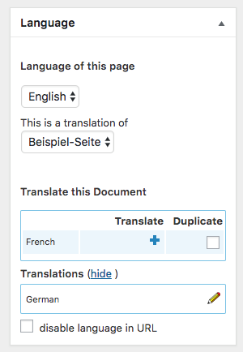

## Wordpress WPML - partial slug remover - Plugin

Trying to have Wordpress pages with language URLs – and the Blog homepage without ?

When using WPML and "folder URL structure" you can modify partial pages to be called without language
information in their URL.

```
example.com/en/
example.com/en/blog
example.com/en/blog/example-post
example.com/en/blog/category/example-category
example.com/en/example-page
example.com/en/another-example-page

```

can be modified to

```
example.com/en/
example.com/blog
example.com/blog/example-post
example.com/blog/category/example-category
example.com/example-page
example.com/en/another-example-page
```

Heads up! This plugin supports only the "language folder" option of WPML.

Activate the Plugin and manage the behavior with "WPML->Translation options"


"not translatable" - every active language get removed from the url for this post type or taxonomy.

"translatable" - an option "disable language in URL" appears for this post type within the wpml post box.
Check this checkbox to remove the language folder for this item only.  


if you set an item to "not translatable" the option "disable language in URL" 
is not visible because the language folder get removed anyway in any case.

### how to remove language folder from "/blog"
1. set posts to "not translatable" 
2. create a "blog" page
3. check "disable language in URL" for blog page
4. setup "blog page" within "settings->read"
5. set permalink structure to "/%category%/%postname%/"
6. update permalinks 